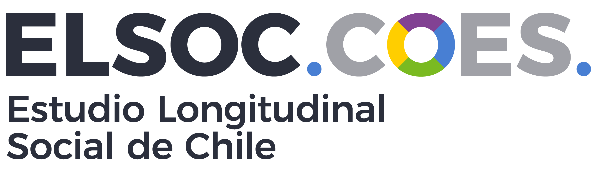

--- 
title: "Efectos políticos de las huelgas"
subtitle: "con ELSOC 2016-2022"
author: "Equipo Fondecyt"
site: bookdown::bookdown_site
documentclass: book
bibliography: ["bib/book.bib"]
csl: "bib/apa-no-ampersand.csl"
biblio-style: apalike
link-citations: yes
linkcolor: blue
geometry: "left=4cm, right=3cm, top=2.5cm, bottom=2.5cm"
fontsize: 12pt
linestretch: 1.5
toc-depth: 1
lof: True
lot: True
description: "Efectos políticos de las huelgas"
github-repo: "DaniOlivaresCollio/efectos-huelgas"
always_allow_html: true
editor_options: 
  markdown: 
    wrap: 72
---


```{r setup, include=FALSE}

library(pacman)
p_load(bookdown,
       knitr)

knitr::opts_chunk$set(cache=FALSE, warning=FALSE, message=FALSE, echo=FALSE, fig.topcaption = TRUE, fig.align = 'center')
Sys.setlocale("LC_ALL","ES_ES.UTF-8")
```

```{r formats, include=FALSE }
table_format <- if (is_html_output()) {
  "html"
} else if (is_latex_output()) {
  "latex" 
}

fullw <- if (is_html_output()) {TRUE} else if (is_latex_output()) {FALSE}
fsize <- if (is_html_output()) {14} else if(is_latex_output()) {8}

ggplot2::theme_set(new = ggplot2::theme_test(base_family = "serif"))
options(knitr.kable.NA = '')

```


# Presentación {-}


<!-- ```{js, echo = FALSE} -->
<!-- title = document.getElementById('header'); -->
<!-- title.innerHTML = '' + title.innerHTML -->
<!-- ``` -->

<div style="text-align: justify">

Preparación y exploración de datos ELSOC 2016-2022 para analizar variables que puedan relacionarse a los efectos políticos de las huelgas.

Se debe considerar que los ítems del cuestionario ELSOC no se presentan en todas las olas.

Las olas corresponden a los siguientes años:

- Ola 1: 2016
- Ola 2: 2017
- Ola 3: 2018
- Ola 4: 2019
- Ola 5: 2021
- Ola 6: 2022
- Ola 7: 2023

La muestra original comienza el año 2016, se incorpora una muestra de refresco el 2018.

En junio de 2024 se contará con la séptima ola correspondiente al año 2023.